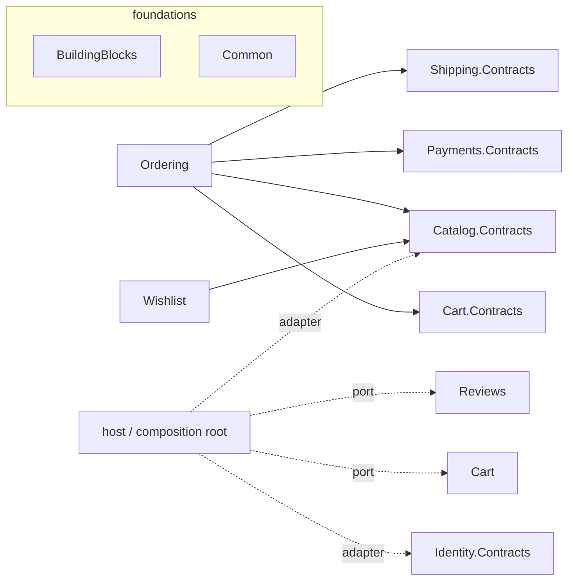

# GymStore Backend — Modular Monolith Architecture

This document describes how the GymStore backend is structured as a **modular monolith**:
one deployable ASP.NET Core app, internally split into independent modules with
compile-time-enforced boundaries. It is the reference for how the modules fit together and
how to add the next one.

> History: the backend began as a single layered project (`backend/backend`) where every
> feature shared one `GymStoreContext` and reached into each other's data freely. It was
> refactored module-by-module (Cart → Catalog → Ordering → Payments → Shipping → Reviews →
> Inventory → Suppliers → Wishlist → Addresses → Identity → Preferences), each on its own
> branch, preserving HTTP behavior at every step.

---

## 1. Solution layout

33 projects under `backend/`:

```
backend/
  backend.sln
  backend/                              HOST / composition root (ASP.NET Core; the "backend" project)
  BuildingBlocks/GymStore.BuildingBlocks        CQRS abstractions + dispatcher
  Common/
    GymStore.Common                     shared kernel: IModule, ICacheStore
    GymStore.Common.Tests
  Modules/<Name>/
    GymStore.Modules.<Name>             the module (Domain / Application / Infrastructure / Api)
    GymStore.Modules.<Name>.Contracts   public cross-module surface (only 5 modules need one)
    GymStore.Modules.<Name>.Tests       xUnit + EF Core InMemory
```

**Twelve feature modules:** Cart, Catalog, Ordering, Payments, Shipping, Reviews, Inventory,
Suppliers, Wishlist, Addresses, Identity, Preferences.
**Contracts projects (5):** Cart, Catalog, Payments, Shipping, Identity — only modules other
modules actually call have one.

---

## 2. Shared foundations

### BuildingBlocks — CQRS (`GymStore.BuildingBlocks`)
Dependency-free CQRS core:
- `ICommand<TResponse>` / `ICommandHandler<TCommand,TResponse>`, `IQuery<TResponse>` /
  `IQueryHandler<TQuery,TResponse>`, and `IDispatcher` (`Send` / `Query`).
- `Dispatcher` resolves the closed-generic handler from DI and invokes it **through the public
  interface method via cached reflection** — so handler classes stay `internal` to their module.
- `AddCqrs()` registers the dispatcher; `AddHandlersFromAssembly(assembly)` scans a module for
  its handlers. No MediatR (no license), no external dependency.

### Common — shared kernel (`GymStore.Common`)
Dependency-light (no ASP.NET, no BuildingBlocks):
- **`IModule`** (`Assembly Assembly`, `void Register(IServiceCollection, IConfiguration)`) — every
  module implements it, so the host registers them uniformly (no growing per-module lists).
- **`ICacheStore`** — a typed `IDistributedCache` + JSON + TTL wrapper (`GetAsync<T>` /
  `SetAsync<T>` / `RemoveAsync`). Modules that cache reuse it instead of hand-rolling
  serialization. `AddCommon()` registers it.

---

## 3. Anatomy of a module

Each module is a vertical slice with clear layers:

```
Domain/            module-owned entities (ids only — no navigations to other modules' entities)
Application/
  Abstractions/    module-internal ports (repositories, caches, consumer-defined provider ports)
  Features/<X>/    a CQRS command/query + its handler per use case
  Contracts|Responses/  HTTP response DTOs (curated; never leak entities/secrets)
Infrastructure/
  Persistence/     <Name>DbContext + repositories
  Caching/         cache-aside over ICacheStore              (only modules that cache)
  Public/          <Name>ModuleApi : I<Name>ModuleApi        (only modules with a contract)
Api/               thin controller(s) that dispatch commands/queries
<Name>Module.cs    IModule.Register(...) — wires DbContext, repos, handlers, module API
```

Rules that hold across every module:
- Controllers are thin: they only dispatch a command/query and shape the HTTP result.
- Handlers hold the logic and depend on **abstractions**, never on another module's internals.
- Responses are curated DTOs (e.g. dropping `user`/`product` navigations; never a password hash).
- The module owns its data via its own `DbContext` (see §5).

---

## 4. The modules

| Module | Owns (tables) | Key endpoints | Notable |
|---|---|---|---|
| **Cart** | Carts, CartItems | `GET /api/Cart/{userId}`, `POST .../add/{productId}?quantity=`, `DELETE .../remove/{productId}` | Redis cache-aside; items enriched from Catalog via a host adapter |
| **Catalog** | Products, Categories, ProductImages | `GET /api/Products`, `/Products/id?id=`, `/Products/search`, `/Categories/categories[/{id}]` | Redis cache; exposes `ICatalogModuleApi` |
| **Ordering** | Orders, OrderItems | `POST /api/Orders/place`, `GET /api/Orders/user/{userId}[/year/{year}]` | Composes **four** contracts (Cart, Catalog, Payments, Shipping); computes totals |
| **Payments** | Payments | `GET /api/Payments/order/{orderId}` | `IPaymentModuleApi.CreatePaymentAsync` (called by Ordering); **no card data** stored |
| **Shipping** | Shipments | `GET /api/Shipments/order/{id}`, `PUT .../ship`, `PUT .../deliver` | `IShippingModuleApi.CreateShipmentAsync`; Pending→InTransit→Delivered lifecycle |
| **Reviews** | Reviews | `POST /api/Reviews/{userId}/{productId}?content=&rating=`, `GET /api/Reviews/{productId}` | Reviewer name via a host adapter (→ Identity); fixed a `PasswordHash` leak |
| **Inventory** | Inventories | `GET /api/Inventory/{productId}`, `POST /api/Inventory/update/{productId}?change=` | Fully self-contained (no cross-module data) |
| **Suppliers** | Suppliers | `GET /api/Suppliers`, `GET /api/Suppliers/{id}` | Dropped the embedded inventory/product graph from the response |
| **Wishlist** | Wishlists, WishlistItems | `GET /api/Wishlist/{userId}`, `POST .../add/{productId}`, `DELETE .../remove/{productId}` | Enriches items via `ICatalogModuleApi` (direct) |
| **Addresses** | Addresses | `GET /api/Address/{userId}`, `/{userId}/default/{type}`, `POST`, `PUT /{id}`, `DELETE /{id}` | Full CRUD + Redis cache (via `ICacheStore`) + default-flag rules |
| **Identity** | Users | `POST /api/Auth/register`, `POST /api/Auth/login` | PBKDF2 + JWT + login hardening (see §6); `IIdentityModuleApi` |
| **Preferences** | Preference | `GET /api/Preference/user/{userId}`, `POST /api/Preference/user/{userId}` | Returns unsaved defaults when none exist |

---

## 5. Cross-module communication

Modules never touch each other's tables or internals. They interact in one of two ways.

**(a) Public contract (`I<Name>ModuleApi`).** A module publishes a small `*.Contracts` project
(pure DTOs + one interface). Callers reference only the contract.

- `ICartModuleApi` — `GetCartAsync`, `ClearCartAsync`
- `ICatalogModuleApi` — `GetProductsByIdsAsync`
- `IPaymentModuleApi` — `CreatePaymentAsync`
- `IShippingModuleApi` — `CreateShipmentAsync`
- `IIdentityModuleApi` — `GetUsersByIdsAsync` (non-sensitive user summaries only)

**(b) Consumer-defined port + host adapter (DIP).** When a module needs data but shouldn't take
a compile-time dependency (or the provider was extracted later), it defines its **own** port and
the **host** supplies an adapter over the provider's contract:

- Cart's `IProductInfoProvider` → host `ProductInfoProvider` → `ICatalogModuleApi`
- Reviews' `IReviewerInfoProvider` → host `ReviewerInfoProvider` → `IIdentityModuleApi`

This is why Cart and Reviews have **no** compile-time edge to Catalog/Identity — the host wires it.

### Dependency graph (compile-time)



Every module also references BuildingBlocks + Common (omitted above for clarity). Contracts
projects depend on nothing.

---

## 6. Security (Identity module)

Auth is the most security-sensitive module and was hardened during extraction:

- **Passwords: PBKDF2** (HMAC-SHA256, 100k iterations, 16-byte per-password salt,
  `CryptographicOperations.FixedTimeEquals`), replacing the old **unsalted SHA-256**. Stored as a
  versioned packed blob (`[ver][iters][salt][subkey]`).
- **Transparent upgrade:** a legacy SHA-256 hash still verifies but reports "rehash needed"; on a
  successful login the hash is re-computed with PBKDF2 and saved — existing accounts upgrade
  silently, none break.
- **JWT:** a single `JwtKeyFactory` derives the signing/validation key, used by **both** the token
  service and `AddJwtBearer`, so signing and validation can't diverge (they previously did). The
  missing `app.UseAuthentication()` was added so tokens are actually validated.
- **Login hardening:** one generic `401 "Invalid credentials."` for unknown email or wrong
  password, plus a comparable-cost hash on the missing-user path (anti-enumeration / timing). The
  login response carries only id/name/email/role — never the hash.

Open security follow-ups (see §11): endpoints are not yet `[Authorize]`-protected; the JWT secret
default in the tracked `appsettings.json` should be removed in favor of untracked config.

---

## 7. Data ownership (transitional)

Each module has its **own `DbContext`** mapping only its entities to the **existing** tables,
marked `ExcludeFromMigrations()`. The host's `GymStoreContext` remains the **schema owner** — it
keeps all entity mappings and owns the EF migrations, so no migration/DDL change was needed to
extract any module.

- All runtime reads/writes for a feature go through its module context.
- `GymStoreContext` still maps everything (and still holds the FKs between, e.g., `Orders` and
  `Users`), so nothing was dropped.
- This is deliberately transitional: fully flipping DDL ownership per module (separate schemas /
  migration histories) is future work.

## 8. Caching

Redis is registered once in the host (`AddStackExchangeRedisCache`, instance prefix `GymStore:`).
Modules cache-aside through Common's `ICacheStore`:

- Cart → `cart:{userId}`
- Catalog → `products:all`, `product:{id}`
- Addresses → `addresses:{userId}`

Writes invalidate/refresh the relevant key (e.g. checkout clears the cart cache; saving an address
evicts `addresses:{userId}`).

---

## 9. Composition root (host `Program.cs`)

The host is now essentially wiring:

```csharp
var modules = new IModule[]
{
    new CartModule(), new CatalogModule(), new OrderingModule(), new PaymentsModule(),
    new ShippingModule(), new ReviewsModule(), new InventoryModule(), new SuppliersModule(),
    new WishlistModule(), new AddressesModule(), new IdentityModule(), new PreferencesModule()
};

var mvc = builder.Services.AddControllers().AddJsonOptions(...);
foreach (var m in modules) mvc.AddApplicationPart(m.Assembly);   // discover module controllers

builder.Services.AddCommon();
builder.Services.AddCqrs();
foreach (var m in modules) m.Register(builder.Services, builder.Configuration);

// host adapters bridging consumer-defined ports to provider contracts
builder.Services.AddScoped<IProductInfoProvider, ProductInfoProvider>();   // Cart → Catalog
builder.Services.AddScoped<IReviewerInfoProvider, ReviewerInfoProvider>(); // Reviews → Identity
```
Plus: `AddAuthorization()` (JWT bearer is configured inside `IdentityModule`), Redis, session,
Swagger, `GymStoreContext`, and the pipeline `app.UseAuthentication()` → `UseAuthorization()`.

---

## 10. Behavior preservation & deliberate improvements

Extraction kept every route and JSON shape stable (verified live per module). Where an endpoint
had no consumer, the response was **cleaned up** on purpose and flagged:
- Reviews no longer leak the reviewer's `PasswordHash`/email (safe `reviewerName` instead).
- Suppliers / Wishlist drop heavy embedded cross-module object graphs for curated DTOs.
- Ordering now computes and persists order totals (previously `0`).
- Checkout now evicts the Redis cart cache; a shipment + payment are recorded on placement.

---

## 11. Testing

Per-module xUnit suites on **EF Core InMemory** with hand-written fakes for cross-module ports and
caches — **65 tests total** (Cart 9, Catalog 9, Ordering 5, Payments 3, Shipping 5, Reviews 4,
Inventory 4, Suppliers 2, Wishlist 3, Addresses 4, Identity 11, Preferences 3, Common 3).

Because the default NuGet feed is a private (currently-unreachable) source, restore tests from
nuget.org:

```bash
dotnet test backend.sln -s https://api.nuget.org/v3/index.json
```

---

## 12. How to build & run

Prereqs: .NET 9 SDK, SQL Server `(local)`, Redis (Podman:
`podman run -d --name gymstore-redis -p 6379:6379 redis:7`), a strong `Jwt:Key` in the local
`appsettings.json`, and the DB migrated (`dotnet ef database update --context GymStoreContext`).

```bash
dotnet build backend.sln
```
```bash
# from backend/backend
dotnet run
```
Swagger opens at the root (`http://localhost:5074/`) in Development.

---

## 13. Adding a new module (the recipe)

1. `Modules/<Name>/GymStore.Modules.<Name>` (+ `.Tests`; add `.Contracts` **only** if other
   modules will call it). Reference BuildingBlocks + Common (+ any provider `*.Contracts`).
2. `Domain` entities (ids only) · `<Name>DbContext` mapping the existing table(s) with
   `ExcludeFromMigrations()` · repositories · CQRS `Features` · curated response DTOs · thin
   controller · `<Name>Module : IModule`.
3. Need another module's data? Depend on its `*.Contracts` directly, or define a consumer port and
   add a host adapter.
4. Host: add `new <Name>Module()` to the `modules` array; remove the old host
   controller/service/repository + DI. Keep the entity in `GymStoreContext` (schema owner).
5. Add tests; `dotnet build` + `dotnet test`; smoke the endpoints.

---

## 14. Known transitional state / follow-ups

- **Authorization not enforced** — auth is wired and validated, but no endpoint is `[Authorize]`d
  yet (the API is open). Enforcing it needs coordinated frontend work.
- **JWT secret hygiene** — `appsettings.json` is tracked with a weak default key; move the secret
  to untracked config / user-secrets / a secrets manager (`git rm --cached` the file).
- **DDL ownership** — `GymStoreContext` is still the single schema owner; per-module schemas /
  migration histories are future work.
- **Outbox** — cross-module writes on checkout (payment, shipment, cart-clear) are best-effort
  after the order commits; an outbox would make them exactly-once when Ordering owns its own tx.
